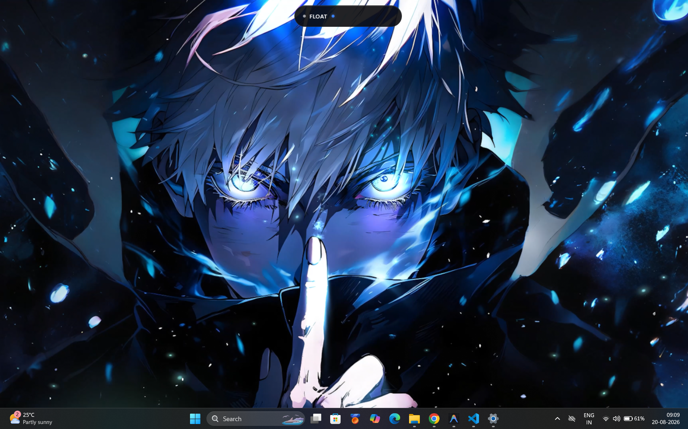
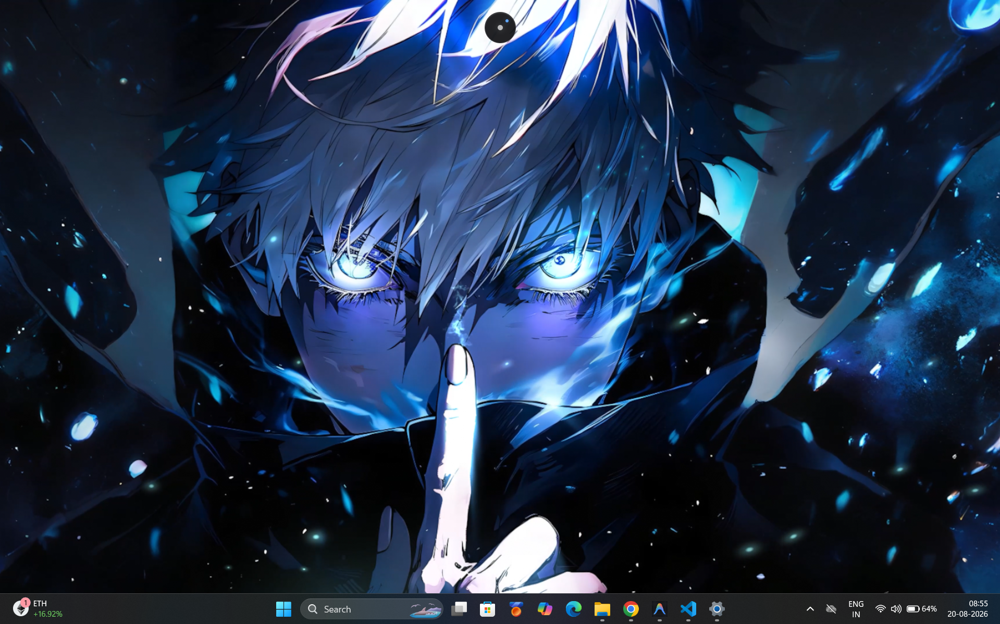
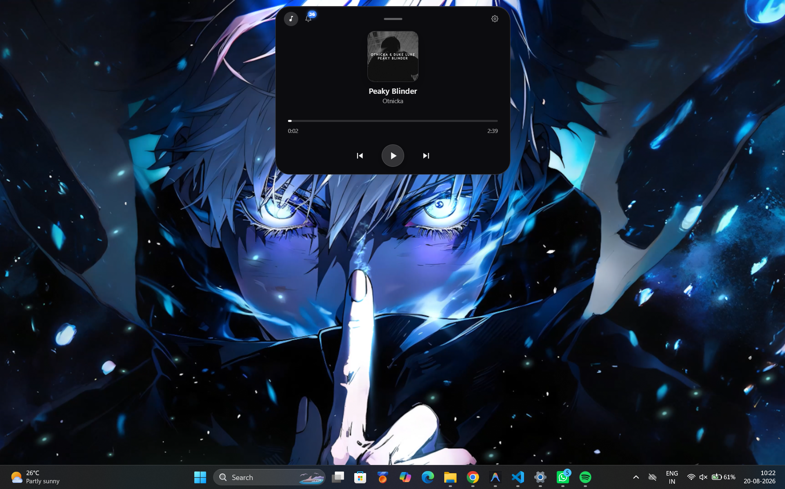
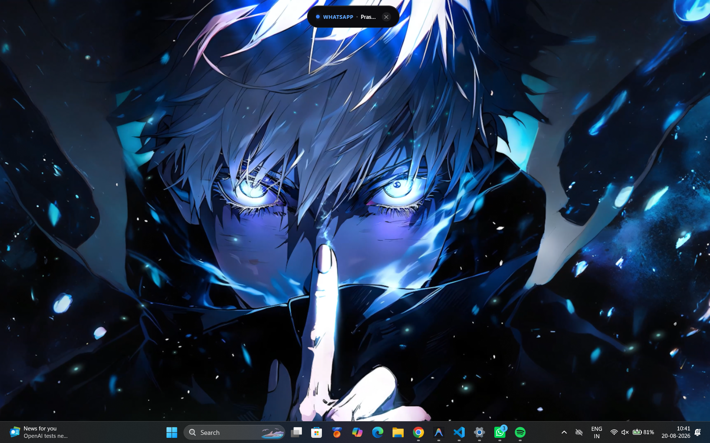
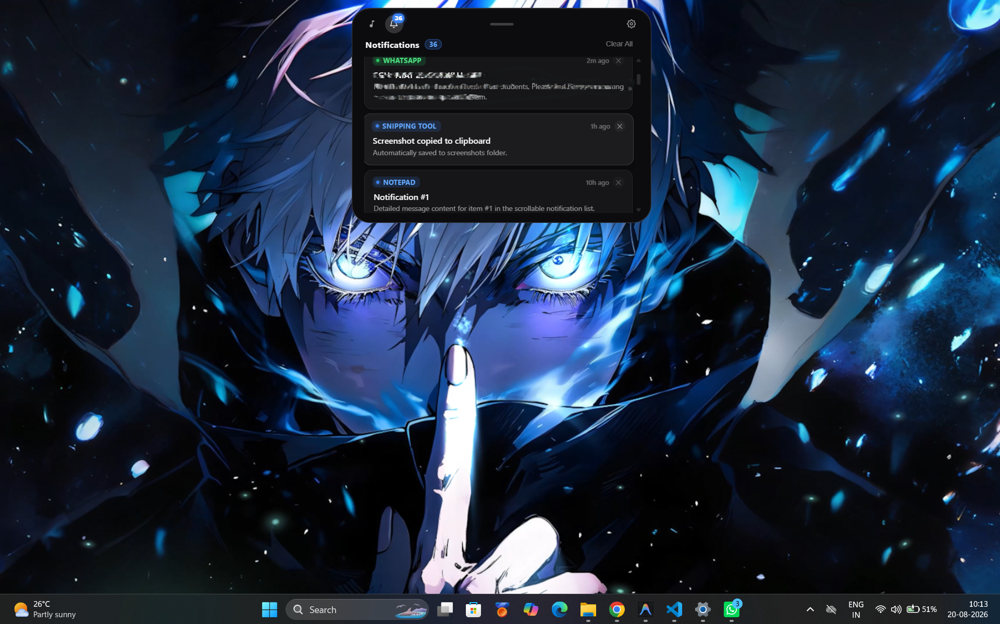
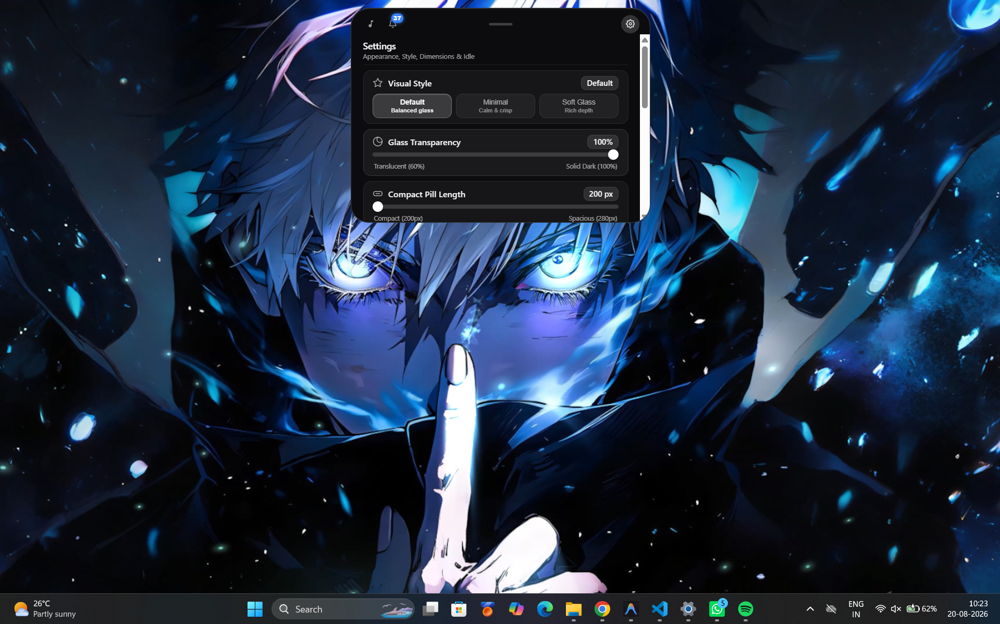

# FLOAT

A Dynamic Island for Windows.

FLOAT is a lightweight MacBook-style notch for Windows. It hangs from the top of your screen and brings media controls, a live audio visualizer, Windows notifications, a volume HUD and quick settings into one place.

## FLOAT v1.0.1

Public release.

---

## ✨ Features

- **Dynamic Pill Interface**: An unobtrusive resting pill at the top-center of your screen that dynamically adapts to system activity.
- **MacBook-Style Notch**: Solid black, flush with the top edge, with concave corners that join it to the bezel. It grows downward to fit whatever is live: a quiet notch when idle, a slim strip for music, a taller drop-down for notifications.
- **Optional Orb Mode**: Prefer a floating circle? Set Idle Behavior to Orb and the island shrinks to a 48×48 orb after ~3 seconds untouched.
- **Interactive Awakening**: Hovering over or interacting with the Orb smoothly restores the active compact pill.
- **Spotify & Windows GSMTC Media Integration**: Universal support for Spotify, Apple Music, YouTube, and browser playback via Windows Global System Media Transport Controls.
- **Live Audio Visualizer**: The equalizer bars follow the actual sound playing (WASAPI loopback, low/mid/high bands), falling back to a gentle animation when output is muted.
- **Album-Art Accent**: The equalizer, progress bar and a soft glow under the notch take on the dominant color of the current album art.
- **Continuous Title Marquee**: Long track titles smoothly scroll in a continuous loop without clipping.
- **Album Artwork**: Embedded album art displayed with fluid cross-fades.
- **Playback Controls**: Instant play/pause, next track, previous track, and interactive timeline scrubbing.
- **Universal Windows Notifications**: Directly integrates with Windows `UserNotificationListener` to detect system and app toast notifications (WhatsApp, Discord, Slack, Outlook, Notepad, etc.).
- **3.5-Second Notification Preview**: Incoming notifications trigger an automatic ~3.5-second island banner expansion.
- **State Restoration**: After 3.5 seconds, FLOAT automatically returns to the exact state it was in before the notification arrived (Spotify player, compact pill, or ambient orb).
- **Persistent Notification Center**: Notifications survive the temporary preview and remain stored in a dedicated Notification Section until dismissed.
- **Notification Count Badge**: Real-time unread count badge in the surface navigation bar.
- **Scrollable Notification List**: Scroll container with fixed headers and custom slim glass scrollbars.
- **Individual Dismissal & Clear All**: Dismiss single notifications with one click or clear the entire history at once.
- **Live Activities & Split Island**: When two things are live at once (for example a notification arrives while music plays), the top one owns the pill and the other detaches into a bubble beside it, Dynamic Island style.
- **Click-Through Window**: Only the island itself catches the mouse; the space around it passes clicks to the apps underneath, and morphs never resize the native window.
- **Hide in Fullscreen**: The island gets out of the way of fullscreen games, videos and presentations.
- **Visual Styles**: Solid Notch by default, or Glass, Minimal and Soft Glass translucent styles with adjustable transparency.
- **Real App Icons**: Notifications show the sending app's icon.
- **Gestures**: Scroll over the island to change volume (with an on-island volume HUD), scroll sideways to skip tracks, swipe a notification up to dismiss it.
- **Spring Physics**: Morphs follow your Animation Intensity, from calm to bouncy, and the island squishes when pressed.
- **Framer Motion Spring Physics**: Natural, physical layout animations and morph transitions.
- **Expanded Surface**: 460×330 px interactive panel featuring three dedicated sections: Media, Notifications, and Settings.
- **Persistent User Preferences**: Local persistence for transparency, pill length, orb size, idle behavior, and privacy toggles.
- **Tray Icon & Global Hotkey**: Open the island from the tray or with `Ctrl+Alt+Space` (falls back to `Alt+Shift+Space` or `Ctrl+Alt+I` if another app owns it).
- **Launch at Startup**: Optional, from Settings or the tray menu.
- **Remembered Position**: Drag the island anywhere; it remembers where you left it and snaps back to top-center when dropped nearby.
- **Multi-Monitor & DPI Aware**: Crisp rendering across standard and high-DPI Windows display scaling.
- **Packaged AppModel Identity**: MSIX package architecture with native Windows restricted capabilities.

---

## 🔄 How FLOAT Works

```text
[ Normal Flow ]
Compact Pill ────────( ~3s untouched )───────► Ambient Orb (48×48)
     ▲                                                │
     └──────────────( hover / double-tap )────────────┘

[ Notification Flow ]
Active State (Media / Pill / Orb)
     │
     ▼ (Windows toast arrives)
Temporary Preview Banner (~3.5s)
     │   (media keeps playing in a split bubble beside the pill)
     │
     ▼ (3.5s dwell expires)
Exact Previous State Restored (Media / Pill / Orb)
     └─► Notification remains saved in Notification Section

[ Media Flow ]
Media Stream Detected ──► Media Pill (Album Art + Marquee Title + Equalizer)

[ Expanded Surface Flow ]
Pill / Orb ──( Click )──► Expanded Surface [ Media | Notifications | Settings ]
```

---

## 🖼️ Screenshots

### Compact Pill



### Ambient Orb Mode



### Media Player & Equalizer



### Notification Preview



### Notification Center



### Expanded Surface & Settings



---

## 🎮 Controls & Gestures

| Gesture / Action | Target | Result |
| :--- | :--- | :--- |
| **Single Click** | Compact Pill | Opens Expanded Surface |
| **Single Click** | Orb | Opens Quick Actions or Notification Preview |
| **Double Click** | Compact Pill | Morphs to Orb |
| **Scroll** | Island | Changes system volume and shows the volume HUD |
| **Scroll sideways / Shift+Scroll** | Island | Previous / next track |
| **Swipe up** | Notification | Dismisses it |
| **Double Click** | Orb | Morphs to Compact Pill |
| **Hover (200ms dwell)** | Compact Pill | Expands to Compact Preview |
| **Hover** | Orb | Wakes up and morphs to Compact Pill |
| **Pointer Leave** | Compact Preview | Returns to Compact Pill (160ms delay) |
| **Click** | Split Bubble | Opens Expanded Surface |
| **Click outside** | Expanded Surface | Collapses back to resting mode |
| **Drag** | Island | Repositions FLOAT; drops near top-center snap back to it |
| **Escape Key** | Expanded Surface / Preview | Closes surface / preview and returns to resting mode |
| **`Ctrl+Alt+Space`** | Anywhere | Toggles the Expanded Surface (see Settings for the active hotkey) |
| **Left-click** | Tray icon | Opens the Expanded Surface |

---

## 🚀 Installation

### For Users

- **Packaged MSIX**: Download `FLOAT.msix` from the [Releases](https://github.com/Sahaj1207/FLOAT/releases) page and install it using Windows App Installer.
- **Microsoft Store**: Microsoft Store distribution is planned for a future release.

### For Developers

Clone the repository and build from source:

```bash
git clone https://github.com/Sahaj1207/FLOAT.git
cd FLOAT
```

---

## ⚡ Quick Start

### Prerequisites

- **Windows**: Windows 10 (Build 17763 / Version 1809+) or Windows 11
- **Node.js**: v18.0 or higher (v20+ recommended)
- **Rust**: 1.75.0 or higher (`cargo`, `rustc`)
- **Tauri Prerequisites**: C++ Build Tools for Visual Studio 2022
- **WebView2 Runtime**: Pre-installed on Windows 11 and modern Windows 10

### Development Mode

```powershell
# Install dependencies
npm install

# Start Vite dev server + Tauri desktop window
npm run tauri dev
```

### MSIX Release Packaging

To compile the production bundle, build the Rust binary with custom protocol, generate the AppxManifest, pack the MSIX, sign it with a developer certificate, and install it locally:

```powershell
powershell -ExecutionPolicy Bypass -File .\scripts\package-msix.ps1
```

---

## 🔐 Privacy

- **Local Processing**: All media and notification data is processed locally on your machine using standard Windows WinRT and GSMTC APIs.
- **No Cloud Account**: FLOAT does not require external user accounts, cloud servers, or API keys for its core functionality.
- **Privacy Mode**: You can disable notification content previews in the Settings tab to hide message titles and bodies while retaining presence dots.

---

## 🛠️ Tech Stack

- **Desktop Framework**: [Tauri 2.0](https://tauri.app/)
- **Backend**: [Rust](https://www.rust-lang.org/) (WinRT, `windows-rs`, `win-gsmtc`, `tokio`, `serde`)
- **Frontend**: [React 19](https://react.dev/), [TypeScript](https://www.typescriptlang.org/)
- **Build Tool**: [Vite](https://vitejs.dev/)
- **Animation Engine**: [Framer Motion](https://www.framer.com/motion/)
- **Webview**: Microsoft Edge WebView2
- **Packaging**: Windows MSIX / AppModel Identity

---

## 📂 Project Structure

```text
FLOAT/
├── .vscode/                # Recommended workspace extensions
├── assets/
│   └── screenshots/        # Official FLOAT screenshots
│       ├── float-media.png
│       ├── float-notification.png
│       ├── float-notifications.png
│       ├── float-orb.png
│       ├── float-pill.png
│       └── float-settings.png
├── docs/                   # Full documentation
│   ├── USER_GUIDE.md       # Complete end-user manual
│   └── DEVELOPMENT.md      # Architecture, IPC, and packaging guide
├── scripts/                # Build and packaging automation
│   └── package-msix.ps1    # Automated MSIX packager with dynamic SDK discovery
├── src/                    # React 19 Frontend
│   ├── components/float/   # FloatPill, FloatOrb, FloatSurface, Notifications, Settings
│   ├── platform/           # Tauri IPC bindings (media, notifications, focus)
│   ├── services/           # Settings persistence and theme application
│   ├── App.tsx
│   ├── index.css
│   └── main.tsx
├── src-tauri/              # Rust Backend
│   ├── icons/              # Application icons for Windows AppX
│   ├── src/
│   │   ├── focus.rs        # Windows Focus Assist / Quiet Hours detection
│   │   ├── lib.rs          # Window sync, commands, and event registration
│   │   ├── main.rs         # Application entry point
│   │   ├── media.rs        # Windows GSMTC media session monitoring & controls
│   │   └── notifications.rs # Windows UserNotificationListener event listener
│   ├── Cargo.toml
│   └── tauri.conf.json
├── .gitignore
├── CONTRIBUTING.md         # Guidelines for contributors
├── LICENSE                 # MIT License
├── package.json
├── tsconfig.json
└── vite.config.ts
```

---

## 📦 Project Status

**FLOAT v1.0.1** is the latest public release.

The v1.0.1 release focuses on stabilizing the interaction model while preserving the core media, notification, Orb, and glass interface experience.

Future enhancements and bug fixes will be tracked through GitHub Issues and Pull Requests.

---

## 📄 License

Distributed under the [MIT License](LICENSE).